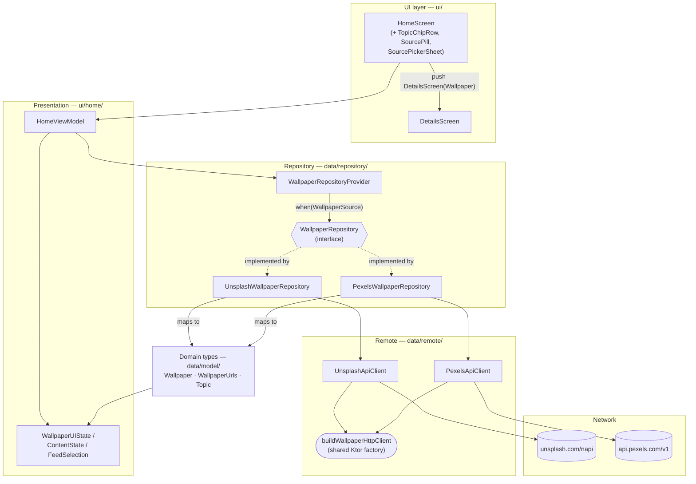
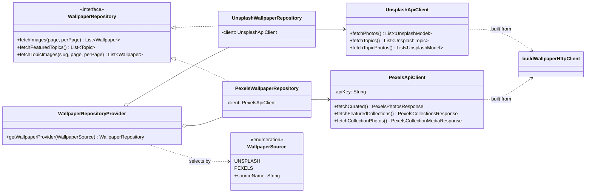
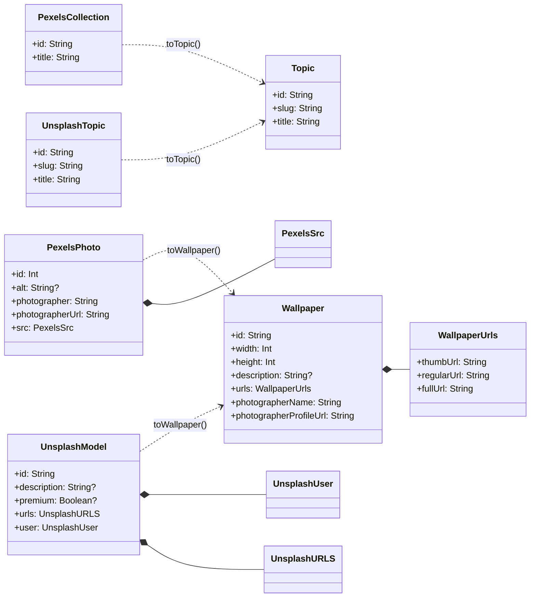
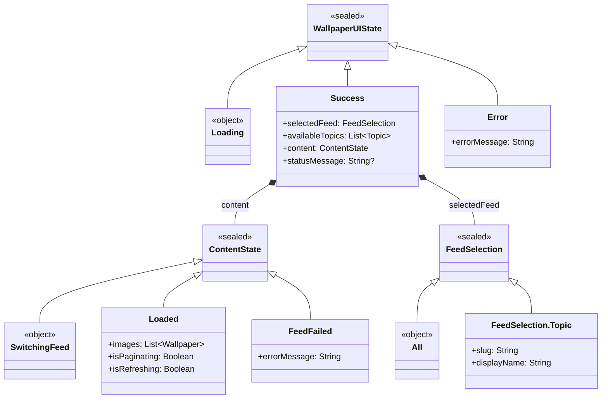
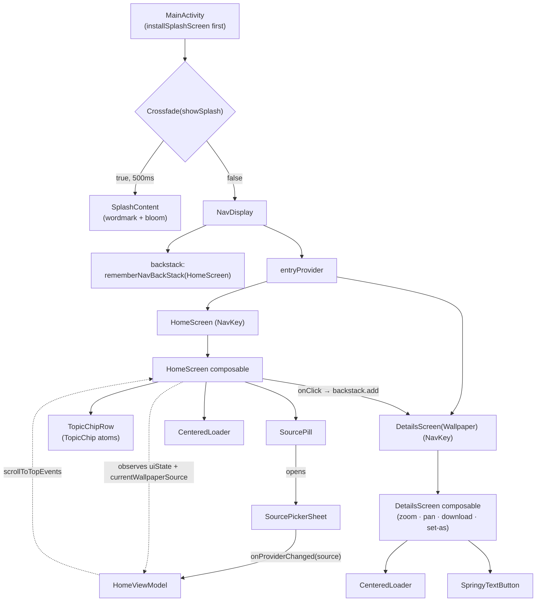

# Splashnt — Architecture Diagrams

> Visual companion to `CLAUDE.md`. Mermaid renders natively on GitHub and in most
> IDE Markdown previews. Diagrams describe the structure as of 2026-06-11 (source
> picker complete). Keep them in sync when the data/UI layers change.

Splashnt is a single-module (`:app`) MVVM Android app. Requests flow **UI → ViewModel
→ Repository (selected by source) → API client → network**, and responses flow back as
**wire DTOs → mappers → provider-neutral domain types → UI state**.

---

## 1. Layered overview

The big picture: which layer talks to which, and where the two providers diverge.
Koin (`di/KoinModule.kt`) constructs every box below and injects the arrows.

> **Note:** Source switching is user-facing as of 2026-06-11: the `SourcePill` in the
> Home header opens `SourcePickerSheet` (a `ModalBottomSheet`), which calls
> `HomeViewModel.onProviderChanged(WallpaperSource)` — that resets to page 1 / feed
> "All", sets `Loading`, and re-fetches both photos **and** topics for the new provider.
> The active source is exposed as `currentWallpaperSource: StateFlow<WallpaperSource>`.

---

## 2. Data layer

### 2a. Repositories & the provider (Strategy pattern)

`WallpaperRepositoryProvider` picks one of two interchangeable `WallpaperRepository`
implementations by a `WallpaperSource` enum — textbook Strategy. Adding a third source
(e.g. Wallhaven) means one new impl + one enum constant + one `when` branch.

### 2b. DTO → domain mapping

Each provider has its own wire-format DTOs. Top-level extension mappers
(`data/mapper/`) do **pure translation** into the shared domain types — no policy.
The premium filter is intentionally *not* here; it lives in the Unsplash repository.

> **Mapping notes:** Pexels `id: Int` → `id.toString()`; blank `alt` → `null`
> (`alt?.ifBlank { null }`); `src.medium / large2x / original` → `thumb / regular / full`;
> a Pexels *collection* has no slug, so `toTopic()` uses `slug = id`.

---

## 3. UI state model

`HomeViewModel` exposes a single `StateFlow<WallpaperUIState>`. The nesting makes
illegal states unrepresentable: e.g. you can only be "switching feed" *inside* a
`Success`, never as a free-floating flag. All three are sealed hierarchies.

> **Naming clash worth knowing:** `FeedSelection.Topic` (a UI selection: slug +
> display name) is distinct from the domain `Topic` (the wire-equivalent featured
> category). `Success` holds both — `selectedFeed` (which chip is active) and
> `availableTopics: List<Topic>` (which chips exist).

---

## 4. UI components & navigation flow

The UI layer is mostly `@Composable` functions (not classes), so it's shown as a
component/flow diagram. `MainActivity` runs a two-stage splash, then a Navigation 3
`NavDisplay` over a `mutableStateList`-backed backstack.

> `SplashContent` is deliberately **not** a Nav 3 destination — users never navigate
> to it, so it lives outside `NavDisplay` and is gated by a `Crossfade`, not the backstack.

---

## Keeping this current

These diagrams are hand-maintained, not generated. Touch them when you:
- add/remove a `WallpaperSource` or repository (§2a),
- change a domain type or mapper (§2b),
- restructure `WallpaperUIState` / `ContentState` / `FeedSelection` (§3),
- add a navigation destination (§4).
